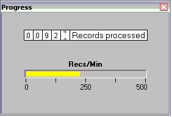



## Mileage Counter and Speedometer OCX Control

### Description

A new type of progress indicator (mileage counter and speedometer), similar to the one you have in your car. Check it out, download is only 17 kB.
 
### More Info
 

             |
---                |---
**Submitted On**   |2002-04-11 17:16:28
**By**             |[ULLI](https://github.com/Planet-Source-Code/PSCIndex/blob/master/ByAuthor/ulli.md)
**Level**          |Intermediate
**User Rating**    |4.8 (67 globes from 14 users)
**Compatibility**  |VB 6\.0
**Category**       |[Graphics](https://github.com/Planet-Source-Code/PSCIndex/blob/master/ByCategory/graphics__1-46.md)
**World**          |[Visual Basic](https://github.com/Planet-Source-Code/PSCIndex/blob/master/ByWorld/visual-basic.md)
**Archive File**   |[Mileage\_Co710014112002\.zip](https://github.com/Planet-Source-Code/ulli-mileage-counter-and-speedometer-ocx-control__1-33699/archive/master.zip)

